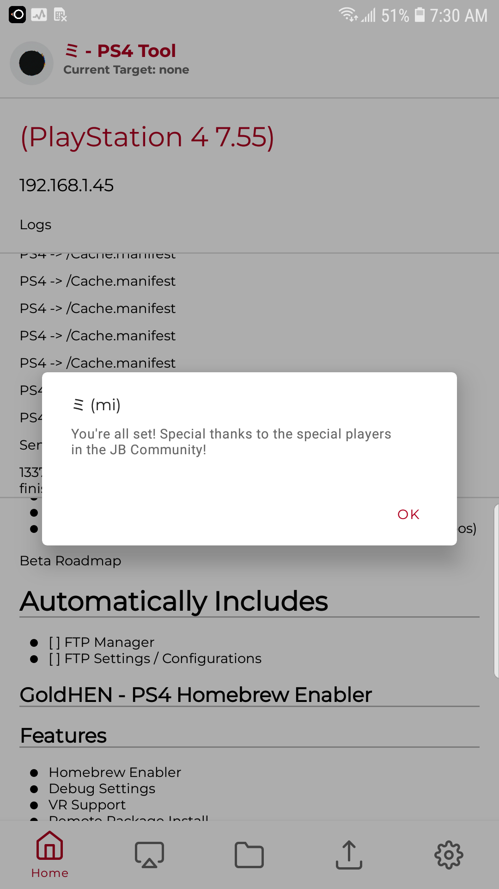
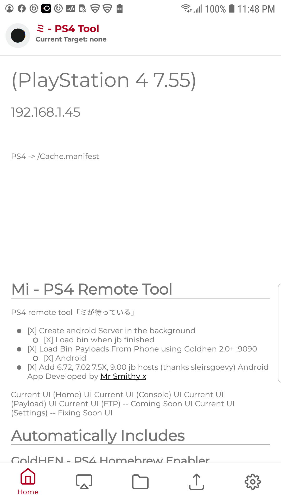
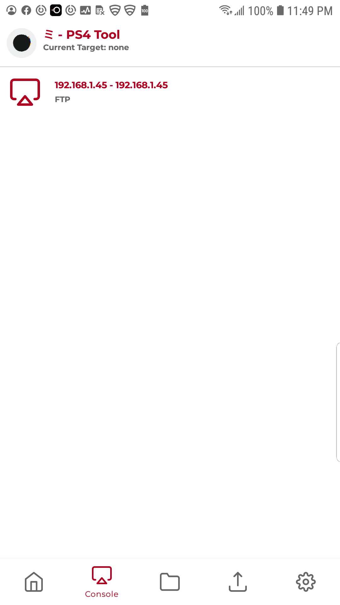
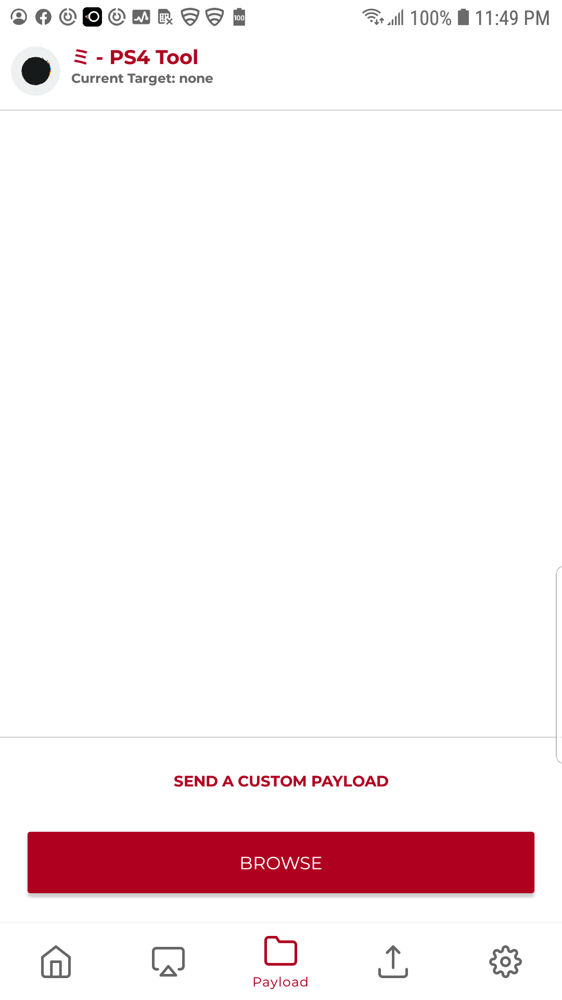
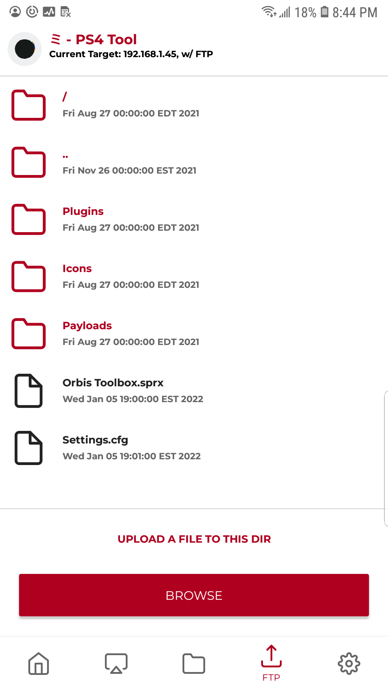
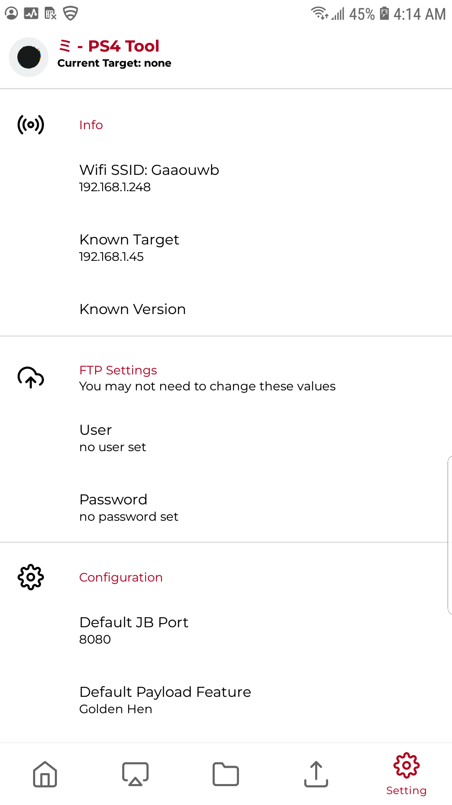
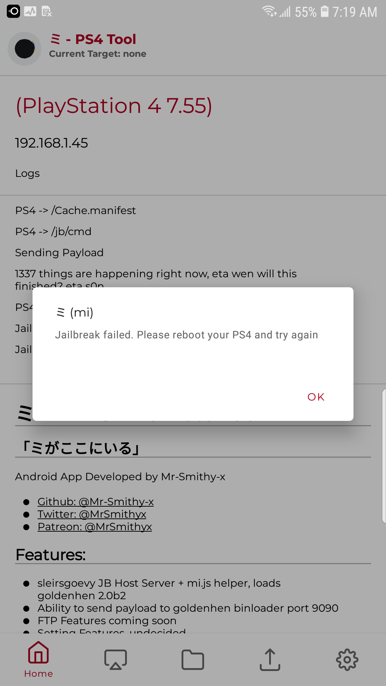

# ミ Mi - PS4 Remote Tool　

Jailbreak Complete UI

## 「ミがここにいる」
Android App Developed by Mr-Smithy-x

- [Github: @Mr-Smithy-x](https://github.com/Mr-Smithy-x)
- [Twitter: @MrSmithyx](https://twitter.com/MrSmithyx)
- [Patreon: @MrSmithyx](https://patreon.com/MrSmithyx)

## Steps:
- Open App
- Clear PS4 cache, and all that jazz, Enter: http://{android_ip_here}:8080/ (on PS4)
- Click that only hyperlink at the bottom (on PS4 ofc)
- exploit will do exploity things, just wait as the app loads the payload (may take a while depending on connection)  
- Profit (on PS4)

## How to load consoles (as of beta)
Once you jailbreak, and goldenhen is loaded, turn on ftp in goldenhen and click the target

## Features:
- sleirsgoevy JB Host Server + mi.js helper, loads goldenhen 2.0b2
- Ability to send payload to goldenhen binloader port 9090
- FTP Features coming soon
- Setting Features, undecided
- mi.js, just an extension for the android app to help send status updates to the android app

## Alpha Roadmap
- [X] Create Android JB Server in the background
- [X] Load bin when jb finished
- [X] Load Bin Payloads From Phone using Goldhen 2.0+ 9090
- [X] Add 6.72, 7.02 7.5X, 9.00 jb hosts (thanks to sleirsgoevy repos)

## Beta Roadmap
- [X] FTP Manager
- [] FTP Settings / Configurations

# Automatically Includes

## GoldHEN - PS4 Homebrew Enabler
## Features
- Homebrew Enabler
- Debug Settings
- VR Support
- Remote Package Install
- Rest Mode Support
- External HDD Support
- Official External HDD Format Support
- Debug Trophies Support
- sys_dynlib_dlsym Patch
- UART Enabler
- Never Disable Screenshot
- Remote Play Enabler
- FW Update Block
- FTP Server on 2121 port
- BinLoader Server on 9090 port
- CE-30391-6 Error CMOS Fix

### Credits

Special thanks to ps4 dev scene:
- [Specter](https://github.com/Cryptogenic) - research
- [SiSTRo](https://github.com/SiSTR0) - golden hen
- [golden](https://github.com/jogolden)  - research
- [Joonie](https://github.com/Joonie86) - research
- [Kameleon](https://github.com/KameleonReloaded) - research
- [OSM](https://github.com/OSM-Made)  - research
- [Al-Azif](https://github.com/Al-Azif)  - research
- [ChendoChap](https://github.com/ChendoChap)
- [flat_z](https://github.com/flatz)  - research
- [idc](https://github.com/idc)  - research
- [kiwidoggie](https://github.com/kiwidoggie)  - research
- [qwertyoruiop](https://twitter.com/qwertyoruiopz)  - research
- [sleirsgoevy](https://github.com/sleirsgoevy) - research
- [SocraticBliss](https://github.com/SocraticBliss) - research
- [Vortex](https://github.com/xvortex) - research
- [zecoxao](https://twitter.com/notzecoxao) - research
- [Znullptr](https://github.com/dmiller423) - research
-  and others not mentions

Screenshots

Home

Console

Payload

FTP: -- Coming Soon

Settings: -- Fixing Soon

FailBreak Failed Screen:
